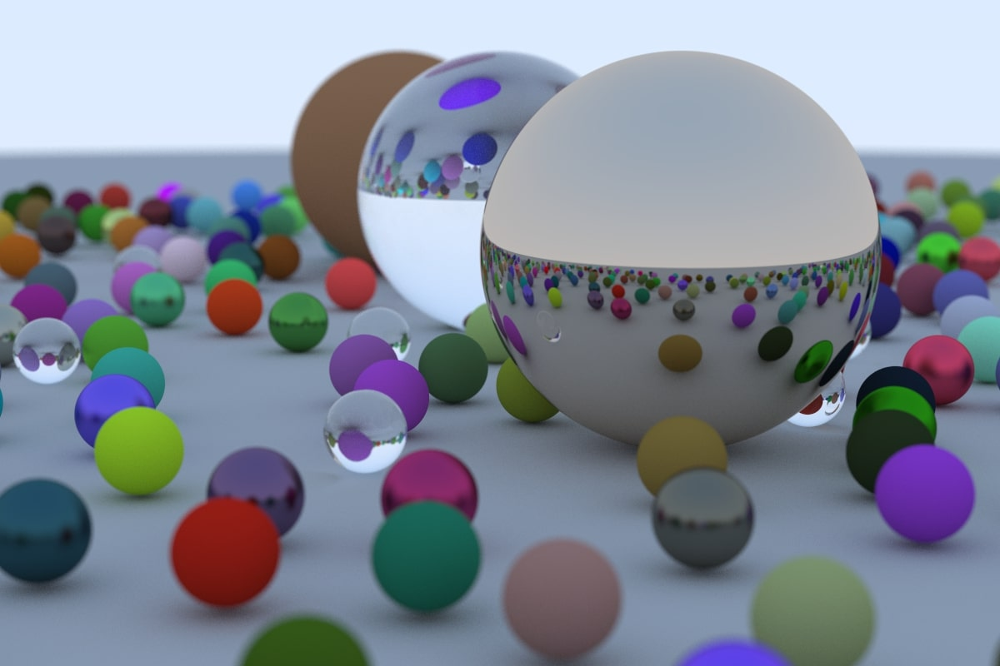

# Ray Tracing

Working through raytracing.github.io in Go.

The image above was rendered in WSL on my desktop PC:

| CPU               | Clock Time |
| ----------------- | ---------- |
| AMD Ryzen 7 5800X | 18:11.90   |
